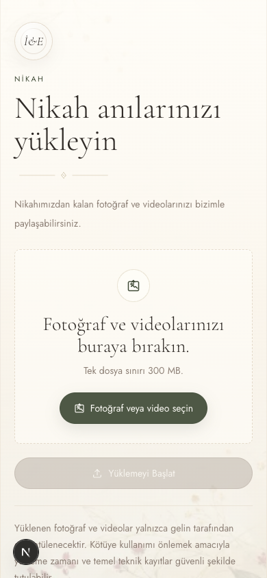

# invitation-webpage

Digital invitation site for Irem & Ekrem. The app renders the main invitation,
event-specific QR landing pages, and guest photo/video upload pages for the
henna night and ceremony.

## Screenshots

Compact mobile captures from the current local build:




## Product Surface

- `/` - the main invitation with event details, countdowns, map actions, music,
  and upload calls to action.
- `/qr/henna` - QR landing page for henna-night memory uploads.
- `/qr/ceremony` - QR landing page for ceremony memory uploads.
- `/upload/henna` - guest photo/video upload page for the henna night.
- `/upload/ceremony` - guest photo/video upload page for the ceremony.
- `/api/upload/sign` - server-side signing endpoint for direct Object Storage
  uploads.

The invitation copy is Turkish and lives in `src/content/copy.ts`. Event facts
live in `src/config/events.ts`.

## Tech Stack

- Next.js App Router with TypeScript and React.
- Tailwind CSS v4 through `@tailwindcss/postcss`.
- `motion` for client-side animation.
- AWS S3 SDK packages for S3-compatible presigned `PUT` URLs.
- Hetzner Object Storage as the intended storage provider.
- Netlify-oriented build settings in `netlify.toml`.

## Local Development

```bash
pnpm install
pnpm dev
```

Useful checks:

```bash
pnpm lint
pnpm exec tsc --noEmit
pnpm build
```

## Environment

Copy `.env.example` to `.env.local` and fill the values:

```env
OBJECT_STORAGE_ENDPOINT=https://fsn1.your-objectstorage.com
OBJECT_STORAGE_REGION=fsn1
OBJECT_STORAGE_BUCKET=your-private-bucket
OBJECT_STORAGE_ACCESS_KEY_ID=your-access-key
OBJECT_STORAGE_SECRET_ACCESS_KEY=your-secret-key
UPLOAD_IP_HASH_SECRET=your-random-ip-hash-secret
NEXT_PUBLIC_SITE_URL=https://your-site.netlify.app
```

Hetzner locations currently use endpoints such as `fsn1.your-objectstorage.com`,
`nbg1.your-objectstorage.com`, and `hel1.your-objectstorage.com`. Keep the
region and endpoint location in sync.

One-line product distinction: Hetzner Volumes are block storage for servers;
direct browser uploads need S3-compatible Hetzner Object Storage.

## Upload Architecture

Uploads are direct-to-storage. The Next API route signs the upload and writes a
JSON metadata sidecar; it does not proxy or buffer the uploaded file.

```text
Browser -> Next API: request a presigned upload URL
Next API -> Object Storage: create PUT URL and metadata JSON
Browser -> Object Storage: upload the file directly with PUT
```

The current upload constraints are:

- Max file size: 300 MB.
- Accepted file types: images and videos.
- Upload method: one presigned `PUT` per file.
- Parallel upload limit: 3 files.
- Object keys stay under `uploads/{event}/{sessionId}/files/`.
- Metadata keys stay under `uploads/{event}/{sessionId}/metadata/`.

In local development, missing Object Storage configuration returns
`STORAGE_CONFIGURATION_ERROR`; the browser upload client uses that error to run
the existing simulated upload fallback.

## Hetzner Object Storage Setup

1. Create a private Object Storage bucket in Hetzner Console.
2. Create S3 credentials for the project or bucket.
3. Set the `OBJECT_STORAGE_*` environment variables.
4. Configure CORS for the production domain and local development origin.

Example AWS CLI CORS configuration for direct browser `PUT` uploads:

```json
{
  "CORSRules": [
    {
      "AllowedOrigins": [
        "https://your-site.netlify.app",
        "http://localhost:3000",
        "http://127.0.0.1:3000"
      ],
      "AllowedHeaders": ["*"],
      "AllowedMethods": ["PUT", "GET", "HEAD"],
      "MaxAgeSeconds": 3000
    }
  ]
}
```

Apply it with:

```bash
aws s3api put-bucket-cors \
  --bucket your-private-bucket \
  --cors-configuration file://cors.json \
  --endpoint-url https://fsn1.your-objectstorage.com
```

Relevant Hetzner docs:

- [Object Storage overview](https://docs.hetzner.com/storage/object-storage/overview/)
- [Using libraries with Object Storage](https://docs.hetzner.com/storage/object-storage/getting-started/using-libraries/)
- [Applying CORS policies](https://docs.hetzner.com/de/storage/object-storage/howto-protect-objects/cors/)

## Deployment

Netlify uses:

```bash
pnpm build
```

The configured publish directory is `.next`. Set the same `OBJECT_STORAGE_*`,
`UPLOAD_IP_HASH_SECRET`, and `NEXT_PUBLIC_SITE_URL` values in the deployment
environment before enabling real uploads.
