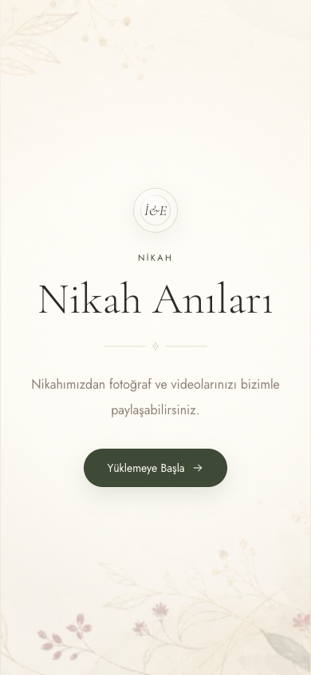
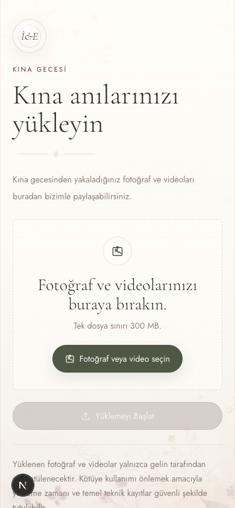
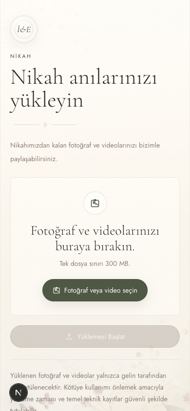
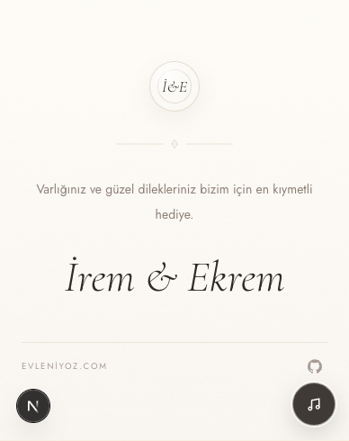

# invitation-webpage

Digital invitation site for Irem & Ekrem. The app renders the main invitation,
event-specific QR landing pages, and guest photo/video upload pages for the
henna night and ceremony.

Live site: [evleniyoz.com](https://evleniyoz.com/) · Source: [GitHub](https://github.com/ekremrn/invitation-webpage)

## Screenshots

Compact mobile captures from the current site build:







## Product Surface

The production site is hosted at [https://evleniyoz.com](https://evleniyoz.com/).

- `/` - the main invitation with event details, countdowns, map actions, music,
  and upload calls to action.
- `/qr/henna` - QR landing page for henna-night memory uploads.
- `/qr/ceremony` - QR landing page for ceremony memory uploads.
- `/upload/henna` - guest photo/video upload page for the henna night.
- `/upload/ceremony` - guest photo/video upload page for the ceremony.
- `/api/upload/sign` - server-side signing endpoint for direct Object Storage
  uploads.

The invitation copy is Turkish and lives in `src/content/copy.ts`. Event facts
live in `src/config/events.ts`.

## Tech Stack

- Next.js App Router with TypeScript and React.
- Tailwind CSS v4 through `@tailwindcss/postcss`.
- `motion` for client-side animation.
- AWS S3 SDK packages for S3-compatible presigned `PUT` URLs.
- Cloudflare R2 through its S3-compatible API for private guest uploads.
- Netlify hosting with the `evleniyoz.com` custom domain.

## Local Development

```bash
pnpm install
pnpm dev
```

Useful checks:

```bash
pnpm lint
pnpm exec tsc --noEmit
pnpm build
```

## Environment

Copy `.env.example` to `.env.local` and fill the values:

```env
OBJECT_STORAGE_ENDPOINT=https://your-account-id.r2.cloudflarestorage.com
OBJECT_STORAGE_REGION=auto
OBJECT_STORAGE_BUCKET=your-r2-bucket
OBJECT_STORAGE_ACCESS_KEY_ID=your-access-key
OBJECT_STORAGE_SECRET_ACCESS_KEY=your-secret-key
UPLOAD_IP_HASH_SECRET=your-random-ip-hash-secret
NEXT_PUBLIC_SITE_URL=https://evleniyoz.com
```

Create a private Cloudflare R2 bucket, generate scoped R2 S3 API credentials,
and keep the access key and secret key only in local or deployment environment
variables. `OBJECT_STORAGE_ENDPOINT` is the account-level R2 S3 endpoint; the
bucket name is configured separately.

## Upload Architecture

Uploads are direct-to-storage. The Next API route signs the upload and writes a
JSON metadata sidecar; it does not proxy or buffer the uploaded file.

```text
Browser -> Next API: request a presigned upload URL
Next API -> Object Storage: create PUT URL and metadata JSON
Browser -> Object Storage: upload the file directly with PUT
```

The current upload constraints are:

- Max file size: 300 MB.
- Accepted file types: images and videos.
- Upload method: one presigned `PUT` per file.
- Parallel upload limit: 3 files.
- Media keys stay under `uploads/{event}/media/{yyyy-mm-dd}/` and include the
  timestamp, session id, and upload id in the filename.
- Metadata keys stay under `uploads/{event}/metadata/{yyyy-mm-dd}/` and use the
  same timestamp, session id, and upload id for easy matching.

In local development, missing Object Storage configuration returns
`STORAGE_CONFIGURATION_ERROR`; the browser upload client uses that error to run
the existing simulated upload fallback.

## Cloudflare R2 Setup

1. Create a private R2 bucket in the Cloudflare dashboard.
2. Create an R2 API token with Object Read & Write permission scoped to this bucket.
3. Set the `OBJECT_STORAGE_*` environment variables using the R2 S3 endpoint and credentials.
4. Configure bucket CORS for `https://evleniyoz.com` and local development.

For the R2 dashboard’s CORS Policy JSON editor, use:

```json
[
  {
    "AllowedOrigins": [
      "https://evleniyoz.com",
      "https://www.evleniyoz.com",
      "http://localhost:3000",
      "http://127.0.0.1:3000"
    ],
    "AllowedHeaders": ["Content-Type"],
    "AllowedMethods": ["PUT"],
    "ExposeHeaders": ["ETag"],
    "MaxAgeSeconds": 3600
  }
]
```

The bucket remains private. The browser uploads with a short-lived presigned
URL generated by `/api/upload/sign`; CORS only permits the configured site
origins to make those browser requests.

## Hosting and deployment

The project is hosted on Netlify and uses `evleniyoz.com` as its custom domain.
Netlify runs:

```bash
pnpm build
```

The configured publish directory is `.next`. Set the same
`OBJECT_STORAGE_*`, `UPLOAD_IP_HASH_SECRET`, and `NEXT_PUBLIC_SITE_URL` values
in the production environment before enabling real uploads.

## Repository

The source repository is [github.com/ekremrn/invitation-webpage](https://github.com/ekremrn/invitation-webpage).
The repository contains the application source, public design assets, and
project documentation. It does not contain Cloudflare credentials, upload
secrets, or private guest media.

## Checks

```bash
pnpm lint
pnpm exec tsc --noEmit
pnpm build
```
